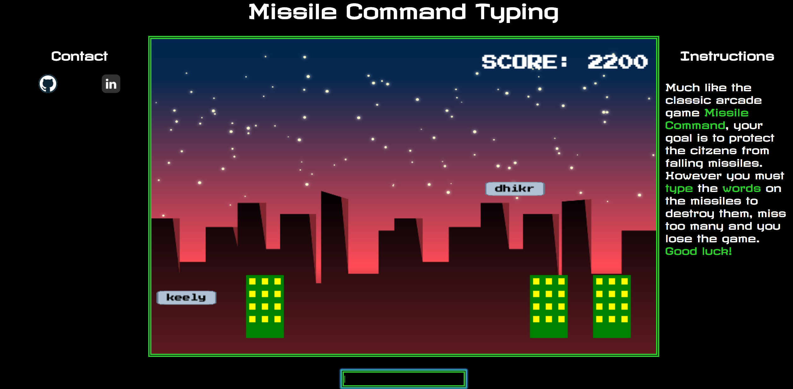

# Missile Command

[Live](https://colinritchey.github.io/Missile-Command-Typing/)

### Background

Missile Command is an arcade game that came out in 1980 and was published by Atari, Inc. and designed by Dave Theurer. A iteration of this game appeared in a mini-game within the browser game Frog Fractions in 2012, which was developed by Jim Crawford of Twinbeard Studios.

The basic premise is that the player must prevent missiles from landing by clicking where the counter-missiles will be launched and explode. Too many missiles landing on the ground and the player loses.

This iteration will have a command prompt and each missile will have text overlaying them. The player must type the word on the missile and a counter-missile will automatically launch and hit the falling missile. These are randomly selected words (from a pool of possible words) and when the player spells the right word the prompt will clear.



There were two points of interest about this project that I will go into more
detail in some of the later sections. First, in the iteration of missile command that Jim Crawford made, I noticed
the trajectory of counter-missiles were instant. This makes for some easy
calculations however I wanted to experiment with calculating a "homing missile" behavior.
Second, I stubbled on an interesting limitation about canvas when it comes to
making asynchronous calls.

### Architecture and Technologies

  - Javascript and Jquery for game logic and structure
  - HTML5 Canvas for DOM manipulation and rendering
  - Webpack to bundle and serve up the various scripts.

### Vector Calculation

Using basic vector calculus, when the user types the correct word on a missile
the the point of impact is calculated base on it's position, velocity and the
amount of time it has left. The counter missile velocity takes that point
of impact and creates a trajectory to intersect the missile.

```Javascript
  pointOfImpact(vel, pos, time){
    return [vel[0] * time + pos[0], vel[1] * time + pos[1]];
  },

  counter_velocity(start, finish, time){
    let x = (finish[0] - start[0])/time;
    let y = (finish[1] - start[1])/time;

    return [x, y];
  },
```

### Asynchronous Calls and Canvas

When trying load Google Fonts into the canvas element I realized the font
was reverting to one of the default fonts given by the browser. After
some research I found that HTML5 Canvas wont re-render itself like other
html elements after a promise has been completed. This would mean having
recreate the canvas object, which would also have to recreate the whole game.

The solution is to have a HTML element with the needed Google font on the
index page and create the canvas when the user presses space. In fact the
intro screen is simply a div that gets replaced once the game starts.


```css
.start-screen{
  color: white;

  font-family: 'Press Start 2P', cursive;
}
```  

```HTML
  <section class="content-container">
    <div class="start-screen">
        press "space" to start typing
    </div>
    <canvas id="demoCanvas" class="canvas" width="800px" height="500px"></canvas>
    <input type="text" id="user-prompt" ></input>
  </section>
```

```javascript
  document.body.onkeyup = (e) => {
    if(e.keyCode === 32){

      $(".start-screen").hide();
      let ctx = canvasEl.getContext("2d");

      let game = new Game();
      let board = new Board(game, ctx);
      board.start();

      user_input.focus();
    }
  };

```

### Future features

  - Explosions for the missile and buildings
  - Difficulty setting, larger words and/or faster missiles
  - sound effects
